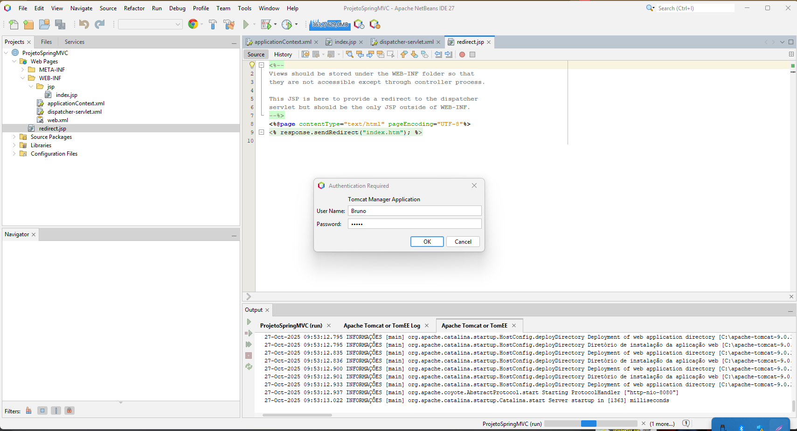
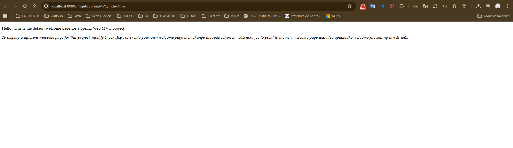
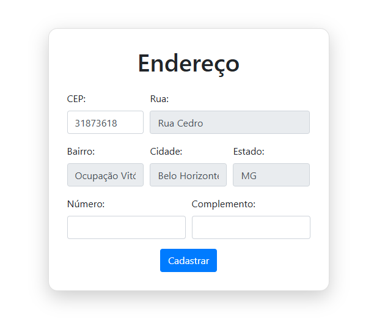
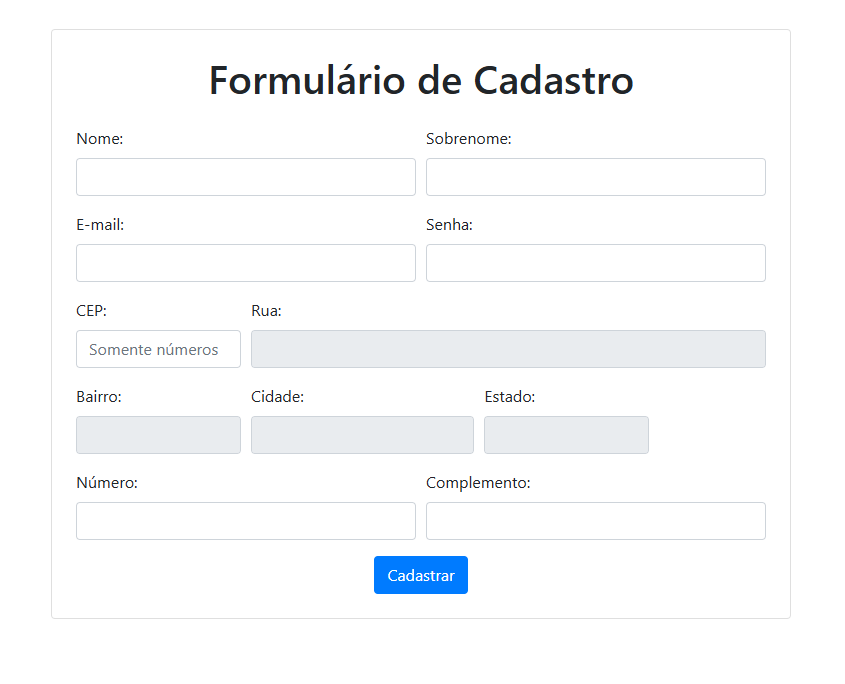
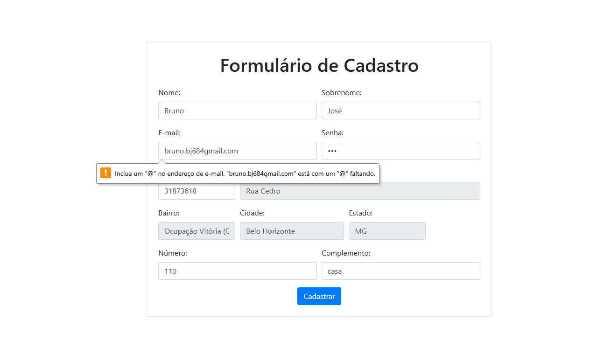
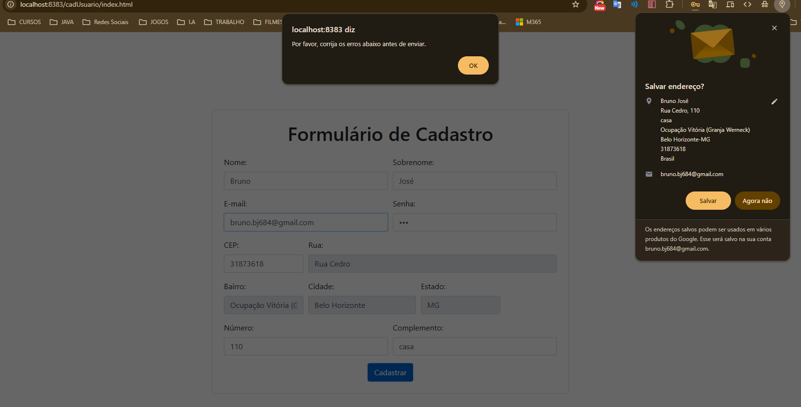
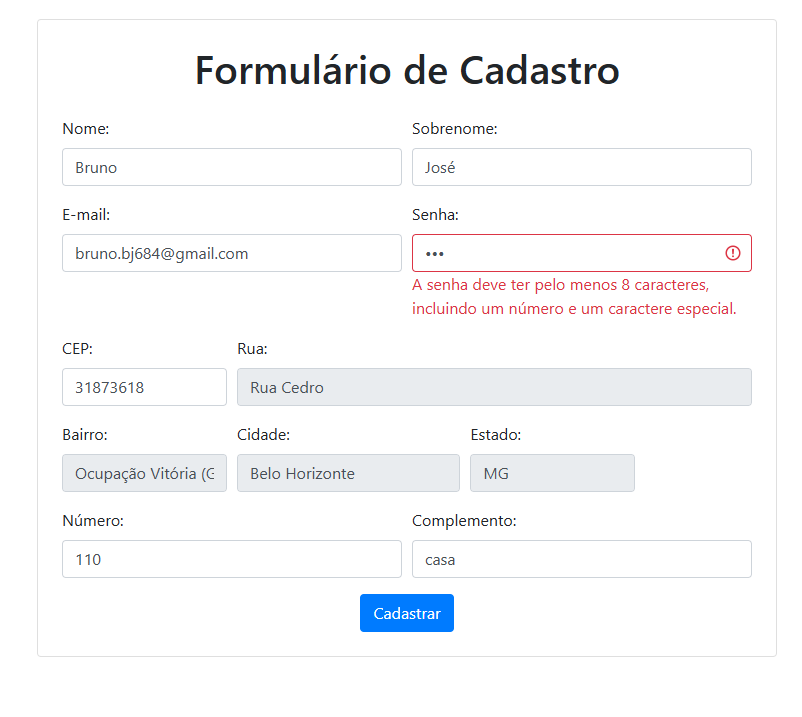

# Portfólio de Desenvolvimento Web – Cadastro de Usuário


**Disciplina:** Framework para Desenvolvimento de Software  

---

## 🔹 Descrição do Projeto

Este repositório apresenta o portfólio de atividades práticas realizadas durante a disciplina **Framework para Desenvolvimento de Software**, abordando desenvolvimento de aplicações web utilizando:

- Java + Spring MVC  
- HTML5, CSS3  
- JavaScript (puro e JQuery)  
- Framework Bootstrap 4/5  

O objetivo principal foi criar um **formulário de cadastro de usuários** com validação de campos, preenchimento automático de endereço via **API ViaCEP**, integração Front-end e Back-end, e estilização profissional com **Bootstrap**.  

---

## 🔹 Estrutura do Projeto

O portfólio foi desenvolvido em **quatro partes**, cada uma em projeto separado no NetBeans:

1. **Parte 1 – Configuração do Ambiente e Teste do Servidor**
   - Projeto Java Web simples para validar o ambiente NetBeans + Tomcat.  

2. **Parte 2 – Formulário HTML5 com API ViaCEP**
   - Projeto HTML5/JS chamado `WebPages`.
   - Arquivos principais:  
     - `index.html` – formulário de endereço  
     - `styles.css` – estilização com Bootstrap  
     - `script.js` – consumo da API ViaCEP  

3. **Parte 3 – Integração Front-end com Spring MVC**
   - Projeto Java Web chamado `cadastroUsuario`.
   - Arquivos principais:  
     - `index.jsp` – formulário de cadastro completo  
     - Integração com Spring Web MVC  
     - CDN do Bootstrap 5 incluído  
     - Redirecionamento configurado em `redirect.jsp`  

4. **Parte 4 – Validação de Formulário com JQuery**
   - Projeto HTML5/JS chamado `cadUsuario`.
   - Arquivos principais:  
     - `index.html` – formulário completo  
     - `main.js` – consumo da API ViaCEP  
     - `validation.js` – validação de campos com JQuery  

---

## 🔹 Funcionalidades

- Formulário de cadastro completo com os seguintes campos:  
  - Nome  
  - Sobrenome  
  - E-mail  
  - Senha  
  - CEP (com preenchimento automático de Rua, Bairro, Cidade e Estado)  
  - Número  
  - Complemento  
- Validação de campos obrigatórios  
- Validação de formato de e-mail usando **JQuery**  
- Responsividade com **Bootstrap 5**  
- Separação de lógica de API e validação em arquivos JS distintos  

---

## 🔹 Tecnologias Utilizadas

- **Front-end:** HTML5, CSS3, JavaScript, JQuery, Bootstrap 4/5  
- **Back-end:** Java, Spring Web MVC  
- **Servidor:** Apache Tomcat 8.x  
- **IDE:** NetBeans  

---

## 🔹 Instalação e Execução

### Para projetos HTML5/JS (Parte 2 e 4)

1. Clone o repositório:
   ```bash
   git clone https://github.com/seu-usuario/nome-do-repositorio.git

2. Abra a pasta do projeto no NetBeans ou diretamente no navegador.

3. Abra o arquivo index.html no navegador.

4. Teste o formulário preenchendo os campos e verificando validações e preenchimento automático do CEP.

### Para projetos Java Web (Parte 1 e 3)

1. Abra o NetBeans.

2. Importe o projeto Java Web (cadastroUsuario).

3. Configure o servidor Apache Tomcat.

4. Execute o projeto → o formulário deve abrir no navegador com Spring MVC funcionando.

## 🔹 Prints e Demonstrações

- Inclua prints das seguintes telas para referência:

- Estrutura do projeto no NetBeans

- Formulário HTML5 com Bootstrap

- Preenchimento automático via API ViaCEP

- Validação de campos com JQuery

- Formulário integrado com Spring MVC
















## 🔹 Conclusão

O portfólio demonstra habilidades em desenvolvimento web completo, incluindo:

- Integração Front-end + Back-end

- Utilização de APIs externas

- Validação de dados com JavaScript/JQuery

- Estilização profissional com Bootstrap

Estas competências são essenciais para a construção de sistemas web modernos e responsivos.